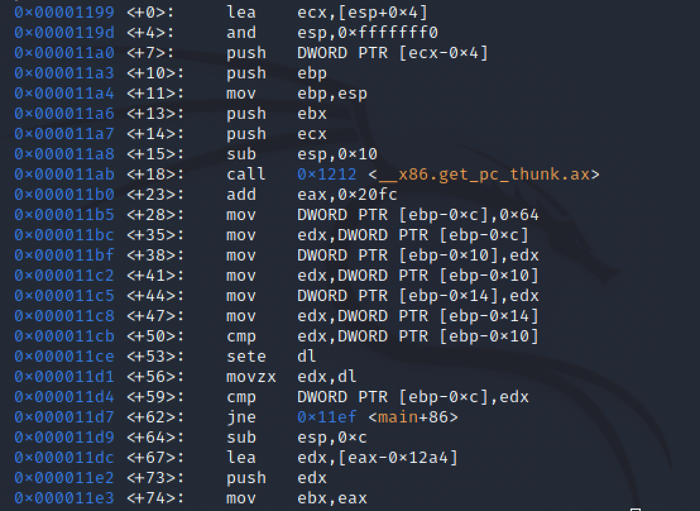
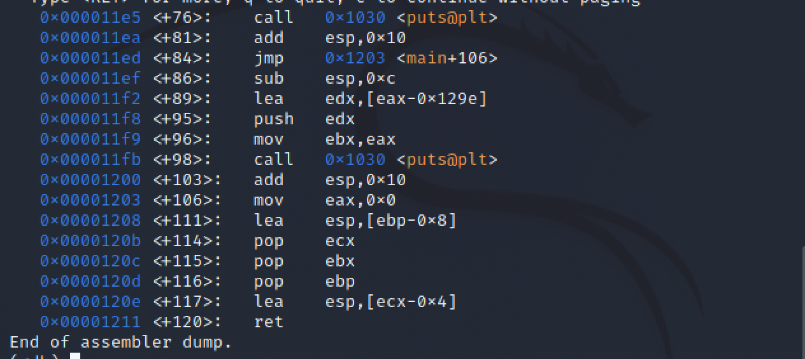

# 1주차 과제 2번
> 아래의 내용은 과제 풀이한 기록입니다.. 끄적끄적 
## 목차 
- 과제 2번
- [요약](#총정리)

----

### 과제 2

`if (a==b==c)` 를 어셈블리어로 분석하라.
```c
#include <stido.h>

int main(void)
{
    int a, b, c;

    a = b = c = 100;

    if (a == b == c)
        printf("True\n");
    else
        printf("False\n");

    return 0;
}
```

 **어셈블리어 변환 모습**

 
 

[과제 1번](./1-assignment.md)에서 핸드레이를 상세하게 표시해서 과제 2번은 간략하게 기록...

```assembly
<+0>:   lea ecx,[esp+0x4]
<+4>:   and esp,0xfffffff0
<+7>:   push DWORD PTR [ecx-0x4]
<+10>:  push ebp                      /* 함수 프롤로그 */
<+11>:  mov ebp, esp                  /* 함수 프롤로그 */
<+13>:  push ebx
<+14>:  push ecx
<+15>:  sub esp,0x10                 /* esp-0x10 감소+ 쓰레기공간+변수공간 할당 */
<+18>:  call <__x86.get.pc_thunk.ax>
<+23>: add eax,0x20fc
<+28>: mov DWORD PTR [ebp-0xc], 0x64   /* ebp-0xc 첫번째 지역변수 v1 = 0x64; */
<+35>: mov edx, DWORD PTR [ebp-0xc]    
<+38>: mov DWORD PTR [ebp-0x10],edx    /* ebp-0x10 두번째 지역변수 v2=v1;*/
<+41>: mov edx, DWORD PTR [ebp-0x10]
<+44>: mov DWORD PTR [ebp-0x14],edx    /* ebp-0x14 세번째 지역변수 v3=v2; */
<+47>: mov edx, DWORD PTR [ebp-0x14]

==> int v3=v2=v1=0x64

<+50>: cmp edx, DWORD PTR [ebp-0x10]    /* v3-v2 비교 -> ZF 1 발생 */
<+53>: sete dl                         /* sete: ZF 1 발생시 dl 0x1  즉 같으면 True 발생(0x1) */
<+56>: movzx edx, dl                   /* movzx: edx 초기화 후 dl값 입력 => edx:0x1 */

==> if (v3==v2)
        return 1;
    else
        return 0;

<+59>: cmp DWORD PTR [ebp-0xc], edx    /* v1-0x1 비교 -> ZF = 0 */

==> if (v3==v2)
    {
        int a = 1;

        if (v1==a)
        ????
    }
    else {
        int a = 0;

        if (v1==a)
        ???
    }


<+62>: jne <main+86>                   /*jne: ZF = 0 일때 점프--> 86으로 이동 */
<+64>: sub esp,0xc
<+67>: lea edx,[eax-0x12a4]
<+73>: push edx
<+74>: mov ebx, eax
<+76>: call <puts@plt>
==> if (v3==v2)
    {
        int a = 1;

        if (v1==a)
            printf("True");
        else
            ?????
    }
    else {
        int a = 0;

        if (v1==a)
            printf("True");
        else
            ?????
    }
<+81>: add esp, 0x10
<+84>: jump <main+106>
<+86>: sub esp,0xc                    /* esp가 0xc만큼 공간할당(쓰레기+ 변수공간)  */
<+89>: lea edx,[eax-0x129e]          /* edx 가 eax-0x129e의 값 가짐 */
<+95>: push edx                      
<+96>: mov ebx,eax
<+98>: call <puts@plt>               /* "False/n" */
<+103>: add esp,0x10 
==> if (v3==v2)
    {
        int a = 1;

        if (v1==a)
            printf("True\n");
        else
            printf("False\n");
    }
    else {
        int a = 0;

        if (v1==a)
            printf("True\n");
        else
            printf("False\n");
    }                
<+106>: mov eax,0x0                  /* eax 초기화 */
<+111>: lea esp,[ebp-0x8]            /* ecx 위치로 이동 */
<+114>: pop ecx                      /* ecx 초기화 */
<+115>: pop ebx                      /* ebx 초기화 */
<+116>: pop ebp                      /*이전 EBP 복귀 */
<+117>: lea esp,[ecx-0x4]           /* 원래 ESP 복귀 */
<+120>: ret                         /* return address */

===> 
#include <stdio.h>

int main(void)
{
    int v3 = v2 = v1 = 0x64

    if ((v3==v2)==v1)
        printf("True\n");
    else
        printf("Flase\n")

    return 0;
}

==> a = v3, b = v2, c = v1

if (a==b==c)

```

### 총정리

과제 2에서 제시된 if(a==b===c) 는 먼저 a == b를 연산한 결과 값(0 or 1)과 c랑 비교한다.
- 1. a==b 비교
- 2. 결과값 0 or 1
- 3. 그리고 c랑 비교
- `== 는 우선순위 -->`
- `= 는 우선 순위 <---`