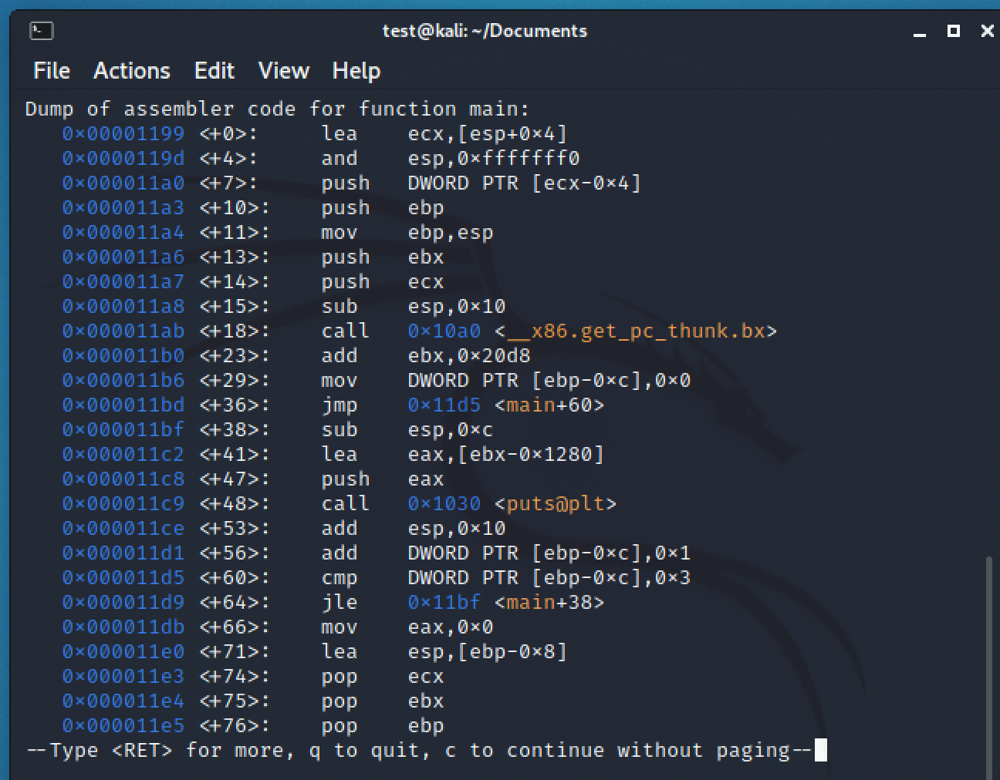
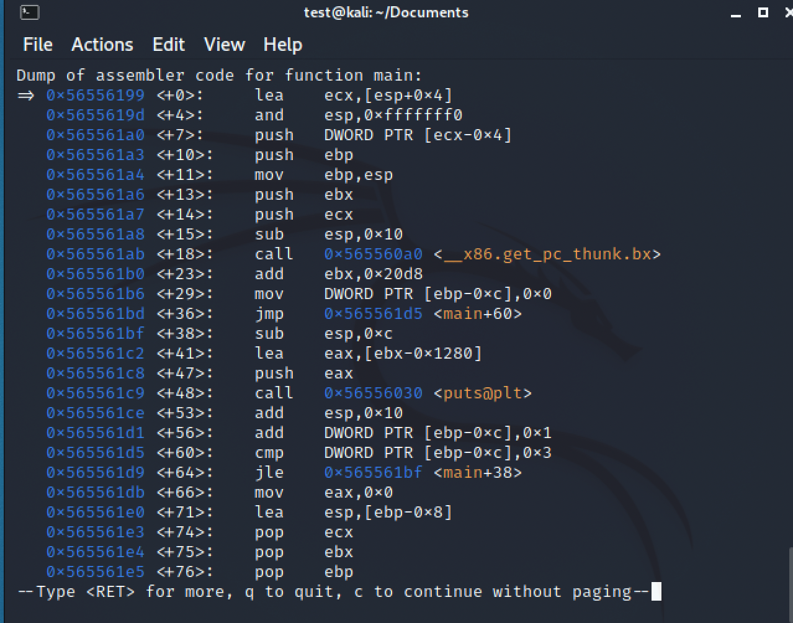
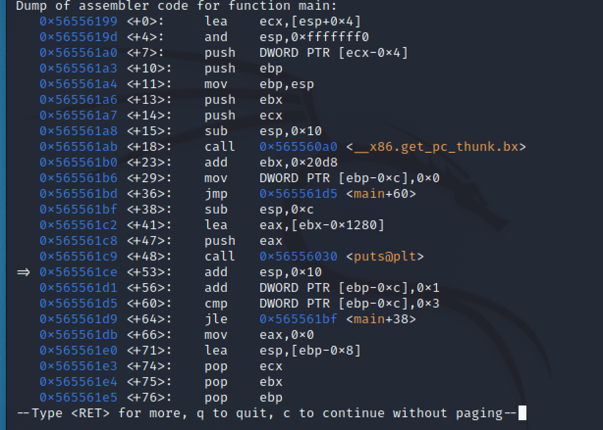

# 1주차 과제 1번
> 아래의 내용은 과제 풀이한 기록입니다... 끄적끄적 
## 목차 
- 반복문 어셈블리어 분석 (과제1)
- [요약](#총정리)

----

### 과제 1
> 실습과정은 `칼리리눅스 2021.02` 버전으로 진행하였습니다.


`vim` 편집기를 열어 `test.c`를 작성한다.


과제1번은 반복문 해석이므로 아래의 예제코드는 다음과 같다.


gcc 명령어를 통해 컴파일 하자.


**만약 오류가 생긴다면 다음과 같은 명령어를 입력하면 된다.**


이제 위의 문제점을 해결한 후에 새로 생긴 `test`파일의 정보를 알아보자.

> 이 파일은 `32-bit, LSB, Dynamically` 의 정보를 알수 있다.
---
gdb를 실행한후 어셈블리어 intel문법으로 변경하자.
> `gdb test`

> `set disassembly-flavor intel` (아래의 사진과 같다.)


gdb를 실행하고 main을 disas한 결과이다.
> 명령어 `disas main`
 

`b *main`을 입력해 main함수에 breakpoint를 걸어준다.
> breakpoint를 걸고 run을 실행하면 breakpoint 전까지 프로그램이 실행한다.


**이제 main의 스텍프레임의 변화를 살펴보자.**



> `main의 0번째 --> lea ecx,[esp+0x4]` 를 살펴보기전에 레지스터의 정보를 알아보자.
> `i r`를 입력하자.

 

- eax의 레지스터 주소는 `0xf7fafae8`이다.
- esp의 주소는 `0xffffdofc`이다.

ni를 실행하여 0번째 명령어를 실행한 결과를 확인하자. (disas main 도 입력)

  

> `lea ecx,[esp+0x4]`는 ecx에 esp에서 +4만큼 떨어진 주소를 복사한다. 다음과 같다.

 

 - `esp: 0xffffdofc`
 - `esp+4 = ecx = 0xffffd100`

다음 명령은 `and esp, 0xfffffff0`이다. 이 명령어는 마지막 4bit를 0으로 만들어준다.
> 주로 x86에서 나타난다.

 

- `esp:0xffffdofc --> 0xffffd0f0`

다음 명령은 `push DWORD PTR [ecx-0x4]`이다. 이 명령어는 다음과 같다.
- `sub esp, 4` 
- `mov [esp], DWORD PTR [ecx-0x4]`
> 해설
esp위치에서 4byte 할당시킨다. esp-4  
  ecx-0x4의 주소에 위치한 메모리의 값은 `x/xw $ecx-0x4`로 입력하면 값을 알수 있다.
  구한 값을 esp 위치에 값을 복사한다.
  즉, esp의 값은 ecx-0x4와 같다.

> `ecx-4의 value: 0xf7defe46 ---> esp의 value: 0xf7defe46`

*주소와 값은 다르다.*

  

 위의 사진을 보면 esp의 주소는 4만큼 감소하였다. esp-4 --> push 명령어
 
 다음 명령어는 `push ebp`이다. --> esp의 주소는 4만큼 감소하고 ebp의 값이 esp에 위치한다.
> push ebp 의미: main 스텍프레임이 소멸할때 main을 호출한 함수의 스택프레임으로 돌아갈때 기존 ebp로 돌아가기 위한 작업이다.

 
 
 - esp 레지스터를 보면 주소가 4만큼 감소한 것을 알수 있다.
 - `esp(명령어 실행 전): 0xffffd0ec --> 0xffffd0e8 (push ebp 실행)`

다음 명령은 `mov ebp, esp`이다. --> esp = ebp --> 스택 프레임 형성

  
 
 - 위의 사진을 통해 알수 있는 정보는 ebp와 esp의 레지스터의 주소도 동일하다. value도 동일
  
  다음 명령어는 `push ebx`이다.

    

- `ebx의 value는 0x0`이다
- esp는 4만큼 감소하였다. `0xffffd0e4`
- esp의 value는 ebx의 value와 동일 할 것 이다. (아래사진에서 알수 있다.)

 

다음 명령어는 `push ecx`이다. --> ecx: 반복문이라는 것을 알 수 있다.

 

 - esp 4만큼 감소 `0xffffd0e0`
 - esp의 value는 ecx의 value와 동일하다. `0x1`
  


다음 명령은 `sub esp, 0x10`이다. --> 즉 esp에 0x10 만큼 공간을 할당한다. esp-0x10


- esp가 0x10만큼 감소한다. `0xffffd0d0`

다음 명령어는 `call 0x565560a0 <_x86.get_pc_thunk.bx>`이다. 이부분은 넘어가도 되지만 이번에는 자세하게 기록 할 예정이므로 이 함수도 핸드레이하자.

- 먼저 함수를 실행하기 전에 main의 call 다음 명령 main+23을 기억해야한다.
- 왜냐하면 call 명령이 실행할때 `push eip(다음 명령 main+23 == 0x565561b0)를 먼저 작동한다`
- why?... 함수가 종료후 main의 어느 명령이 실행해야하는지 알려줘야한다. == ret 기능
- 그리고 함수 내부로 실행하려면 `si` 명령을 입력해야한다.
- 아래 사진을 보면 `disas main이 아닌 것을 알수 있다.`
- 그리고 `push eip`를 통해 esp의 값은 eip의 value(0x565561b0)을 알수 있다.


다음 명령은 `mov ebx, DWORD PTR [esp]`이다. 


> ebx의 값은 esp의 value와 동일하다는 것을 알수 있다.

다음 명령은 `ret` 이다. --> 복귀 명령어 return!
- `pop eip` (이전에 push eip한 그 eip이다.) 
  - eip는 esp의 값이며 esp는 4만큼 증가한다. `0xffffd0d0`
- `jump eip` 
  - eip로 이동한다.


다음 명령은 `add ebx, 0x20d8`이다. --> ebx = ebx + 0x20d8


- `ebx의 값은 0x00003184`

다음 명령은 `mov DWORD PTR [ebp-0xc], 0x0`이다.
- 보통 ebp-4이상 값은 지역변수이다. 하지만 이미 ebp-8은 ecx로 할당되어 있기 때문에 ebp-0xc 부터 지역변수로 설정한다. 
- 즉 ebp-0xc에 0을 할당하는 것은 4byte의 크기를 가진 지역변수에 0을 대입 한 것이다.
- `int i = 0;`과 동일


다음 명령은 `jump main+60`이다.
-> main+60으로 이동하자.


다음 명령은 `cmp DWORD PTR [ebp-0xc], 0x3`이다.
- ebp-0xc는 이전에 지역변수라고 알고 있으므로 i는 0x3 과 비교한다.
- i - 0x3 의 결과 값이 -2이면 eflags 레지스터에 SF가 설정된다(SF=1). 
- i - 0x3의 결과 값이 0이면 (i=3) eflags 레지스터는 ZF가 설정된다. (ZF=1, SF=0)
- i - 0x3의 결과 값이 양수이면 (i는 4이상) eflags 레지스터는 ZF, SF 모두 0이다.


> 현재 i=0 이므로 SF가 설정된다.

다음 명령은 `jle main+38`이다. --> jle 이란? cmp A, B에서 A가 B보다 작거나 같을 경우 점프된다.
- 앞에서 반복문이라는 힌트를 알고 있으므로 for 구문의 종결조건을 알수 있다.
- 즉 다음과 같이 작성할수 있다.

```c
for (int i=0; i <= 3; ???)

```
이렇게 표현할 수 있다.

지금은 점프해야므로 main+38로 이동한다.


- main+38의 명령은 `sub esp, 0xc`이므로 esp가 12만큼 감소한다.

다음 명령은 `sub esp, 0x10`이다. --> 먼저 뒤에 명령중에 call 있는 지 확인하자.
- main+47에 call 이 있다. 그러면 call 명령 앞에 있는 esp는 함수의 인자가 될수 있다.
- 즉 call 앞에 있는 명령 중 esp 밖에 없기 때문에 이 함수는 인자가 하나만 가진다는 것을 알 수 있다.
- esp가 16만큼 공간을 비워둔다. 즉 함수 인자의 데이터가 이 공간을 차지한다.


다음 명령은 `lea eax, [ebx-0x1280]`이다.
그리고 `push eax`를 한다. 즉 ebx-0x1280의 값이 eax가 되며 esp 또한 eax의 값이 된다.
- esp는 함수의 인자이므로 esp의 값은 즉 함수 인자에 들어갈 데이터이다. esp의 값은 "hello"이다.


다음 명령은 `call puts`이다. 즉 printf를 puts 함수로 바꾸어서 표현되어 있다.
함수를 호출 시 "hello"가 나타난다.


- 즉 지금까지 알려진 정보로 다음과 같은 c 언어 예제를 나타낼수 있다.
```c
#include <stdio.h>

int main(void)
{
    for (int i = 0; i <= 3; ???) {
        printf("hello\n");
    }

    return 0;
}
```

다음 명령은 `add esp, 0x10`이다. 
- "hello" 데이터는 0xffffd0c0에 있다. 이 위치는 esp와 동일하다.
- 명령을 실행한후 esp는 0x10만큼 증가하여 esp는 `0xffffd0d0`이 된다.



다음 명령은 `add DWORD PTR [ebp-0xc], 0x1`이다.
- ebp-0xc는 이전에 지역변수라고 소개했다. 즉 i이다. i가 1만큼 증가한다.
- 즉 i++와 같다.
- 지금까지의 정보로 다음과 같은 c언어로 예제를 표현할 수 있다.

```c
#include <stdio.h>

int main(void)
{
    for (int i = 0; i <= 3; i++){
        printf("hello\n");
    }

    return 0;
}
```


다음명령은 cmp이므로 i=3까지 반복한다. 즉 i = 4가 되면 main+66부터 진행하므로 breakdown을 main+66에 설정히고 실행하자.


다음 명령부터는 모든 값을 복귀하고 초기화하는 작업이다.
- `mov eax, 0x0` --> eax를 main 호출 전의 값으로 초기화 하였다.
- `lea esp, ebp-0x8` ---> esp가 ebp-0x8로 위치하며 그 밑에 자라는 스택은 지워진다. 
- `pop ecx` --> 이전에 ebp-0x8에 ecx를 push 했으므로 복귀하기 위해 pop을 한다. esp +4 증가한다.
- `pop ebx` --> ebp-0x4는 명령전의 esp의 위치이며 0x0이 존재한다. 즉 ebx가 0x0으로 된다.(ebx 초기화) 그리고 esp는 ebp와 동일하게 위치하게 된다.
- `pop ebp` --> EBP값 원래 복구한다. 0x0
- `ret` (return address)
  - `pop eip` main을 호출해준 함수의 다음 명령을 eip로 설정한다.
  - `jump eip` main에 벗어나 eip로 점프한다.

아래의 사진은 여러장은 위의 명령 순서를 차례대로....


> esp도 원래의 위치로 복귀한 것을 알수 있다.


## 총정리

---> 반복문에서 필요한 명령어만 표시
```assembly
mov DWORD PTR [ebp-0xc],0x0  /* 초기 값 */
jump <main+60>
<+38>sub esp,0xc
lea eax, [ebx-0x1280]
push eax
call <puts@plt>             /* statements */
add esp, 0x10               
add DWORD PTR [ebp-0xc], 0x1     /* i++ */
<+60>: cmp DWORD PTR [ebp-0xc], 0x3   /* 종결 조건 */
jle <main+38>
move ebp, esp
ret
```
